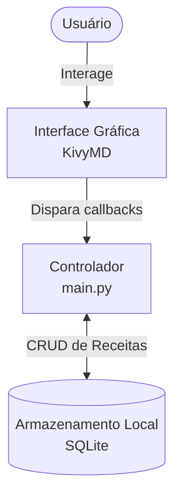
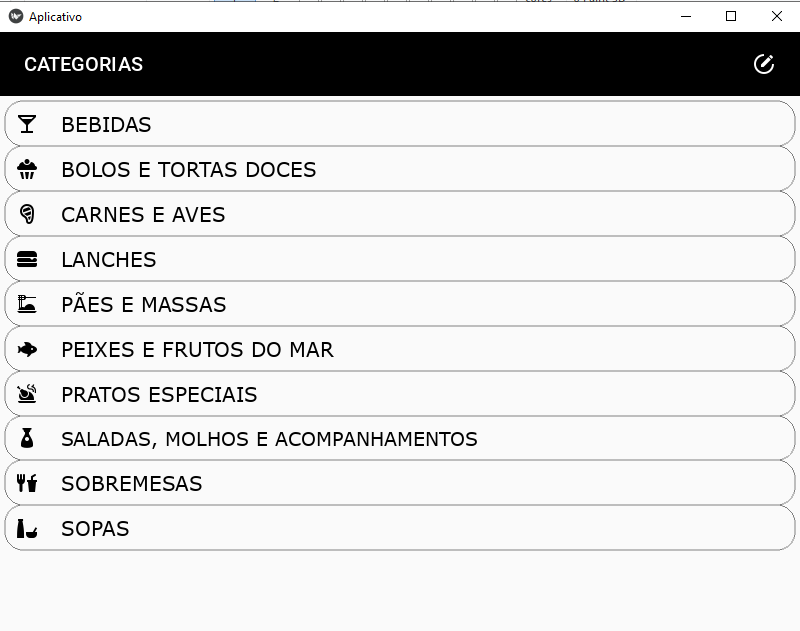
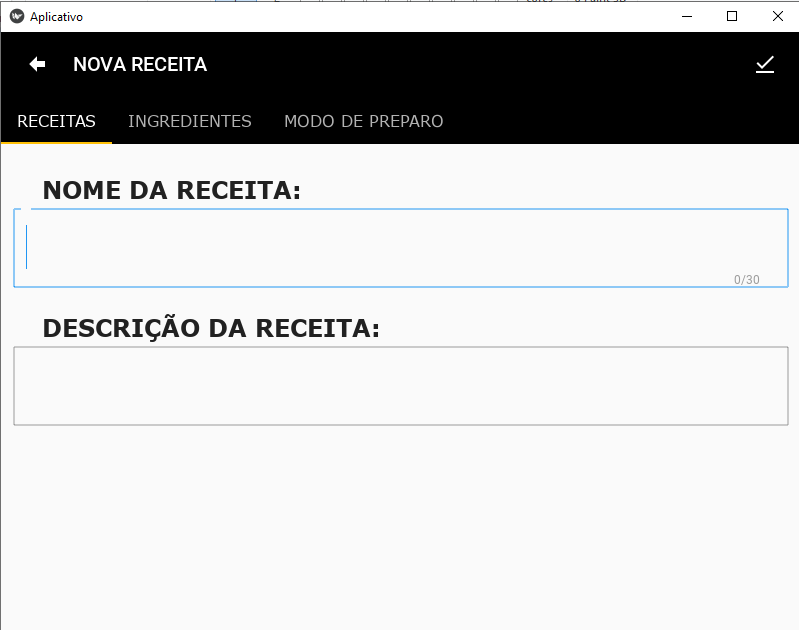

# 📱 RecipeHub - Gerenciador de Receitas

[](https://github.com/betolara1/RecipeHub-Gerenciador-de-Receita/actions/workflows/ci.yml)

## � Objetivo e Problema

O **RecipeHub** é um aplicativo mobile desenvolvido para digitalizar e gerenciar receitas culinárias. 
**O problema resolvido:** A substituição dos antigos e frágeis cadernos de receitas físicos por uma solução digital, centralizada e de acesso *offline*. Ele permite que usuários armazenem, busquem e acompanhem suas receitas favoritas diretamente do smartphone ou computador, sem necessidade de conexão com a internet.

> *Nota: Este foi o meu primeiro projeto em Python e tem um valor sentimental enorme por marcar meu início na programação. Comecei ele em dez 2021 e terminei em março 2022.*

---

## 🏗️ Arquitetura

O sistema segue uma arquitetura baseada em eventos via KivyMD (Frontend) conectando-se diretamente a uma base de dados SQLite (Armazenamento Local) sem necessidade de uma API web intermediária.



---

## 🚀 Como Rodar

Você pode executar a aplicação de forma nativa ou utilizar o Docker para isolamento e testes.

### Pré-requisitos
- Python 3.7+ (Recomendado 3.9)
- SQLite3
- [Docker](https://www.docker.com/) (Opcional, para testes integrados)

### Ambiente de Desenvolvimento (Dev/Nativo)

1. Clone o repositório:
```bash
git clone https://github.com/betolara1/RecipeHub-Gerenciador-de-Receita.git
cd RecipeHub-Gerenciador-de-Receita
```

2. Crie e ative um ambiente virtual (recomendado):
```bash
python -m venv venv

# Windows:
venv\Scripts\activate

# Linux/Mac:
source venv/bin/activate
```

3. Instale as dependências:
```bash
pip install -r requirements.txt
```

4. Execute o aplicativo:
```bash
python main.py
```

### � Docker (Testes e Isolamento)

Aplicações puramente nativas/GUI exigem configurações avançadas de display via DockerX11, sendo assim, a infraestrutura Docker aqui foi arquitetada visando facilitar e isolar a execução dos pipelines de **testes automatizados**.

Para rodar os testes sem sujar sua máquina host usando Docker:

```bash
# 1. Faça o build da imagem
docker build -t recipehub .

# 2. Rode o container em modo interativo passando o pytest
docker run --rm -it recipehub bash -c "pytest tests/"
```

---

## 💻 Exemplos de Uso (Fluxo de Dados Internos)

Como se trata de um app local, o fluxo tradicional de "Request/Response" (típico de REST) é traduzido em interações locais e diretas ao banco de dados SQLite. 

**Salvar uma nova receita** (Insert na Base)
```python
# Dados capturados da UI
categoria_alvo = "SOPAS"
receita = {
    "name": "Sopa de Ervilha", 
    "desc": "Sopa cremosa quentinha", 
    "ingred": "Ervilha, Bacon, Cebola, Água", 
    "prep": "Cozinhar tudo na pressão por 40 mins."
}

# Código executado em background
cursor.execute(
    "INSERT INTO SOPAS VALUES (:id, :name, :desc, :ingred, :prep)", 
    receita
)
db.commit()
```

**Listar receitas de Doces** (Consulta SQL - Query)
```python
cursor.execute("SELECT * FROM DOCES")
receitas = cursor.fetchall()
# A resposta renderiza ListView items da tela principal
```

---

## � Telas do Aplicativo (UI)

A UI foca nas diretrizes e componentes minimalistas do KivyMD.

| Tela de Categorias e Início | Formulário de Receitas |
| :---: | :---: |
|  |  |

---

## 🧪 Testes

Mesmo sendo um projeto focado na UI e feito inicialmente como primeiro contato, introduzimos testes fundamentais. Temos implementados de **5 a 10 testes essenciais**, valendo-se do framework `pytest`. 

Os testes envolvem, primariamente:
- Verificação de criação e setup de banco SQLite mockados.
- Checagem da integridade das 10 tabelas de categorias de alimentos.
- Estados iniciais da aplicação UI e das cores de layout.
- Validação do fluxo de montagem de query de `INSERT`.

**Como rodar manualmente:**
```bash
# Certifique-se de ter instalado o pytest
pip install pytest
pytest tests/ -v
```

---

## ⚙️ GitHub Actions (CI)

O sistema conta com um Workflow pré-configurado `.github/workflows/ci.yml`.

A cada **Push** e **Pull Request** para a branch principal (`main`/`master`), o bot do GitHub irá:
1. Fazer o setup do Python 3.9 na máquina em nuvem do GitHub (`ubuntu-latest`).
2. Fazer cache e instalar o backend/requirements.
3. Checar a sintaxe e formatação via **Lint (flake8)**.
4. Validar os novos códigos em C.I através da **rodada de Testes Automatizados (pytest)**.

Com isso garantimos a confiabilidade das implementações contínuas por qualquer contribuidor.

---

## 🤝 Contribuições

Quer ajudar a melhorar o RecipeHub?
1. Faça um Fork do projeto
2. Crie uma branch para a nova funcionalidade (`git checkout -b feature/NovaFeature`)
3. Commit suas alterações (`git commit -m 'feat: adicionando X novidade'`)
4. Faça o Push para a branch raiz (`git push origin feature/NovaFeature`)
5. Abra um **Pull Request** para discussão

---

## 📄 Licença

Este projeto é desenvolvido livre sob a licença **MIT**. Veja `LICENSE` para detalhes.

---
Feito com ☕ e Python por [Roberto Lara (betolara1)](https://github.com/betolara1).
